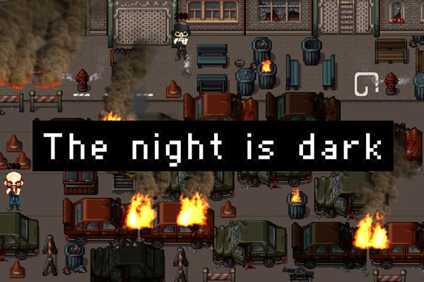

# Game Off 2018: The night is dark

Entry for the Game Off 2018. The game is a survival horror bomberman game made with Unity for WebGL.

Art references (not included in the project):
* [The Soldier - 4 Directions Sprites](https://assetstore.unity.com/packages/2d/characters/the-soldier-4-directions-sprites-94136).
* [Horror City - Tile Pack](https://vexedenigma.itch.io/horror-city-tile-pack).
* [Pixel FX](https://assetstore.unity.com/packages/vfx/particles/fire-explosions/pixel-fx-41545).
* [Pixel Fonts](https://assetstore.unity.com/packages/2d/fonts/pixel-fonts-113588).

Releases:
* [GitHub](https://adcimon.github.io/the-night-is-dark/).
* [Itch.io](https://adcimon.itch.io/the-night-is-dark).
